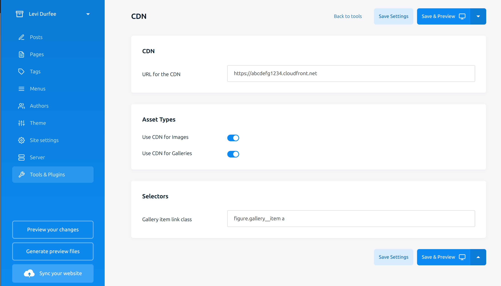

    

## Introduction

The CDN plugin for Publii simplifies the process of using a Content Delivery Network (CDN) with your Publii site. By replacing image URLs with your CDN domain, this plugin helps reduce bandwidth costs and improves page load times.

## How it Works

### Pull CDN

1. Configure your CDN domain: Enter your CDN domain name in the plugin's settings page (e.g., `abcd1234.cloudfront.net`, `cdn.example.com`, etc.).
2. Publish your site: When you publish your site, the plugin searches for image tags in the rendered HTML and replaces them with your CDN domain name.

### Push CDN

1. Configure your CDN domain: Enter your CDN domain name in the plugin's settings page (e.g., `abcd1234.cloudfront.net`, `cdn.example.com`, etc.).
2. In Publii, go to "Tools & Plugins" > "File Manager", in the `root` directory, create a `.gitignore` with the following `media/*`.
3. Publish your site: When you publish your site, the plugin searches for image tags in the rendered HTML and replaces them with your CDN domain name.
4. Copy your `media` folder to your CDN of choice.

## Benefits

- **Reduced bandwidth costs**: By serving images from a CDN, you can reduce the bandwidth costs associated with hosting your site on a server.
- **Faster page loads**: Caching images on a CDN closer to your users' locations can significantly improve page load times.

## Important Notes

- **Image optimization**: This plugin only optimizes image URLs and does not compress or optimize images themselves.

## Settings Page

To get started, simply install the CDN plugin, configure your CDN domain in the settings page, and publish your site.

## Example Use Case

I use this plugin on my personal blog, hosted on an AWS EC2 instance with nginx. By serving images from AWS CloudFront, I've reduced my bandwidth costs and improved page load times. With this plugin, you can achieve similar benefits for your own Publii site.
